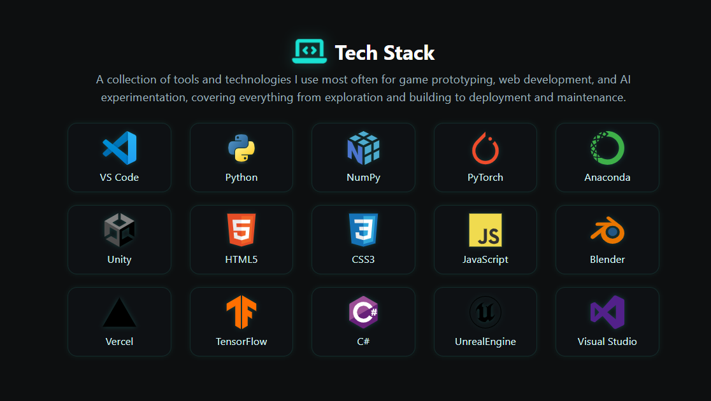
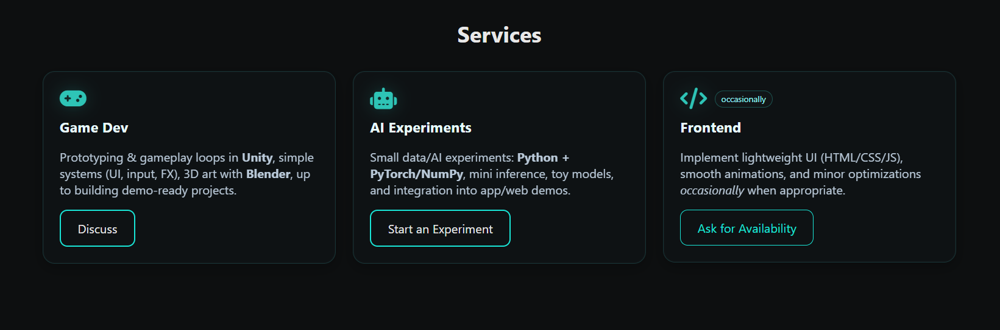
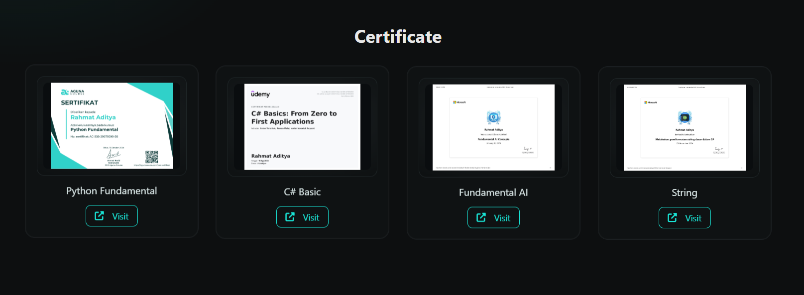

# 🌌 Personal Portfolio

[](https://github.com/rillToMe/Main-Portofolio/stargazers)
[](https://github.com/rillToMe/Main-Portofolio/network/members)
[](./LICENSE)
[](https://ditdev.vercel.app)

---

## ✨ Overview

**Aether Studio** is a personal portfolio site created by **Rahmat Aditya (rillToMe)** -  
a student and developer focused on **AI experiments, Game Development, and creative technology**.  
This website serves as a central hub for all of Adit’s projects, experiments, and personal milestones.

Built with a **neon-dark aesthetic**, smooth animations, and elegant UI transitions.

---

## 🧠 Features

### 🎨 Interface & UX
- Neon-dark theme with soft teal highlights.  
- Responsive design for mobile, tablet, and desktop.  
- Smooth hover & scroll animations.  
- Light / Dark mode toggle with animated transitions.  

### 🎧 Interactive Experience
- **Lo-fi background music** toggle with floating button & soft fade effect.  
- Auto placement to avoid overlapping with the Back-to-Top button.  
- Seamless playback via manual user interaction (no autoplay restrictions).  

### 💼 Sections
- **About Me** - personal description & background.  
- **Tech Stack** - interactive cards showcasing tools used (Python, NumPy, PyTorch, Unity, Blender, etc).  
- **Services** - core skill focus areas:
  - 🎮 *Game Development* - Unity, C#, prototyping.
  - 🤖 *AI Experiments* - small-scale models, PyTorch, NumPy.
  - 💻 *Frontend Development* - HTML/CSS/JS for web demos.
- **Projects** - showcase of real or experimental projects.
- **Certificates** - animated floating cards for achievements.
- **Stats Section** - dynamic info display:
  - `Project Count` - manually managed via JS.
  - `Months Studying` - auto-calculated since **August 28, 2024**.
  - `Experiments Done` - total finished AI or dev experiments.

---

## 🧩 Tech Stack

| Category | Technologies |
|-----------|---------------|
| **Frontend** | HTML5, CSS3, JavaScript |
| **Design & UI** | Neon Theme, Font Awesome Icons, Custom Animations |
| **AI / ML** | Python, NumPy, PyTorch |
| **Game Development** | Unity (C#), Blender |
| **Deployment** | Vercel |
| **Tools** | Visual Studio Code, Visual Studio, Git, GitHub |

---

## 🏗️ Folder Structure

```bash
AetherStudio/
├── api/
│   ├── proxy.js   
├── assets/
│   ├── audio/
│   ├── certs/               # Lo-fi background music
│   ├── css/              # All style files
│   ├── img/              # Images, logos, icons
│   ├── js/               # JS scripts (app.js, bgm.js, stack.js)
│   └── thumbs/           # Certificate preview thumbnails
├── credentials/
│   ├── badges.html/
├── home.html
└── README.md
```

---

## ⚙️ Setup & Local Run

1. **Clone the Repository**
   ```bash
   git clone https://github.com/rillToMe/Main-Portofolio.git
   cd Main-Portofolio
   ```

2. **Run a Local Server**
   You can use VS Code’s Live Server or:
   ```bash
   python -m http.server
   ```
   Then open: [http://127.0.0.1:8000](http://127.0.0.1:8000)

3. **Edit Content**
   - Modify `index.html`, `about.html`, and others for your data.
   - Replace `/assets/audio/lofi.mp3` if you want to use another track.
   - Customize project cards & counts in `/assets/js/app.js`.

---

## 💫 Highlighted Features
- 🧮 **Auto Study Counter** - dynamically counts months since 28 Aug 2024.  
- 🪶 **Floating Certificate Cards** - smooth infinite up-down motion for each card.  
- 🎵 **Smart BGM Button** - auto-adjust position & transitions based on Back-to-Top visibility.  
- 🧊 **Custom Animations** - smooth fade, scroll, and hover transitions built in pure CSS & JS.  

---

## 📸 Preview

| Section | Screenshot |
|:--------|:-----------|
| Tech Stack |  |
| Service |  |
| Certificates |  |

---

## 🌐 Deployment
Deployed using **[Vercel](https://vercel.com/)** for continuous deployment.  
Every push to `main` or `master` automatically updates the live site:

🔗 **Live Site:** [https://ditdev.vercel.app/](https://ditdev.vercel.app/)

---

## 📄 License
This project is licensed under the **MIT License** -  
feel free to use, modify, and distribute with proper attribution.

---

## 👤 Author

**Rahmat Aditya (rillToMe)**  
💼 SMKN 4 Payakumbuh - XI PPLG 2  
🌐 [Portfolio Live](https://ditdev.vercel.app/)  
🐙 [GitHub Profile](https://github.com/rillToMe)  
📧 [rahmataditya.dev@gmail.com](mailto:rahmataditya.dev@gmail.com)

---

> “Build. Learn. Iterate. Evolve - that’s what Aether Studio stands for.”
> - **Rahmat Aditya**
